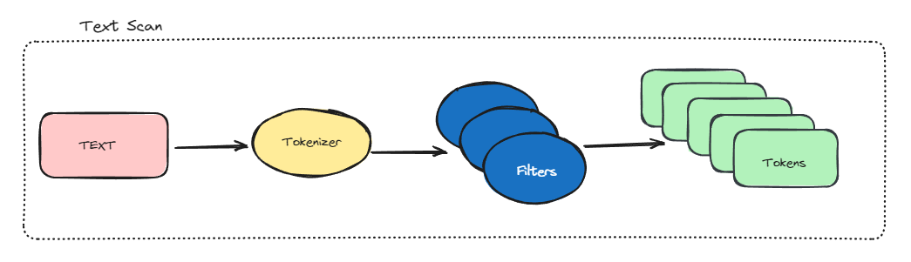

### Full-Text-Search
---- 

#### 简介

本项目基于简单的全文搜索引擎改进而来，实现了以下特点和功能 

1. 支持大数据体量的文档索引存储体系以及毫秒的关键词查询响应，支持中英文索引。
2. 支持实现了接口存储的文档类型，能支持针对文档的多个字段进行索引。
3. 实现的B+树的关键词索引磁盘存储结构，采用分片磁盘管理策略，支持数据页与索引页分页存储。
4. 实现了LRU,LFU的缓存策略。使用了压缩前缀树在内存中存储Term倒排索引。
5. 提供了多种分词器和过滤器，支持词干提取，词性识别和停用词筛选。
6. 扩展布尔查询，实现BM25的相关性排序。
7. 测试了加载和构建维基英文百科的摘要-链接文档的80GB数据集，针对其文档摘要进行索引构建与检索；分析THUCNews数据集中的超过80万条的中文新闻，测试其文档构建与索引查询性能。

#### 体系架构

- ##### 文本构建
    
    

    ```bash
    # en
    > tokenize("The school is located in the old revolutionary base areas in the Dabie Mountains")

    ["school","base","dabie","mountains"]

    # zh
    > tokenize("据中央气象台网站消息，受弱冷空气影响，21日夜间至23日，新疆、内蒙古西部和东北部、青海北部、甘肃西部、东北地区等地的部分地区将有4～6℃降温")
    
    ["中央气象台网站","弱冷空气","新疆","内蒙古","青海","甘肃","东北地区","部分地区","降温"]
    ```

- ##### 体系结构

    

    1. LOAD操作将离散的元数据文档序列化到文档管理器。
    2. 文档管理器（Document-Manager）提供针对文档结构的查询和构建，并提供了持久化存储。
    3. 索引构建起（Indexer）针对文档的指定字段构建索引，除了文本分析部分，还有记录器记录文档被构建的部分。
    4. 索引管理器（Index-Manager）提供了Token的倒排索引，提供Token到文档的映射，提供了持久化存储。
    5. 查询器（Queryer）负责将文本扫描成Token，并向索引管理器查询文档集合。在文档集合根据布尔查询进行合并或者过滤。排序器将查询结果进行优先级排序。


- 文档LOAD过程测试结果

    ```sh
    cd example/sina && go test -v -run TestSinaDocumentBuild

    # output
    2023/09/21 12:40:02 [INFO] H:\CODEfield\GO\src\project\util\fts\example\sina
    2023/09/21 12:40:02 [INFO] C:/Program Files/Go/src/runtime/proc.go
    2023/09/21 12:40:02 [INFO] Init Python Env
    2023/09/21 12:40:02 [INFO] Loading Stopwords Dictionary...        
    2023/09/21 12:40:03 [INFO] Complete Loading Dictionary in 433.1795ms
    2023/09/21 12:40:03 [INFO] Loading types: cnname/cn/en,size: 1144629/2489/923
    loading 746 pause words===
    RUN   TestSinaDocumentBuild
    2023/09/21 12:40:03 [INFO] Loading 14 Targets,
    2023/09/21 12:40:03 [INFO] Loading Targets [H:/dataset/THUCNews/体育 H:/dataset/THUCNews/娱乐 H:/dataset/THUCNews/家居 H:/dataset/THUCNews/彩票 H:/dataset/THUCNews/房产 H:/dataset/THUCNews/教育 H:/dataset/THUCNews/时尚 H:/dataset/THUCNews/时政 H:/dataset/THUCNews/星座 H:/dataset/THUCNews/游戏 H:/dataset/THUCNews/社会 H:/dataset/THUCNews/科技 H:/dataset/THUCNews/股票 H:/dataset/THUCNews/财经]
    .... #filters
    2023/09/21 12:44:13 [INFO] Loading [14/14] Groups,Loding 836075 Files,Total Cose 4m9.2502437s
    success loaded 836075 documents    sina_test.go:86: GC times: 102
        sina_test.go:87: Total GC time: 8599700 ns
        sina_test.go:88: Average GC time: 84310 ns
    --- PASS: TestSinaDocumentBuild (250.48s)
    PASS 
    ok      fts/example/sina        251.646s
    ```
#### 项目目录
```
├─data 压缩数据源
├─example 示例
│  ├─sina
│  └─wiki
└─internal 
    ├─cache 缓存实现
    ├─codec 编码
    ├─common 通用lib        
    ├─disk 磁盘结构
    ├─document 文档结构     
    ├─engine  引擎接口      
    ├─filter 过滤器
    │  ├─cn 中文
    │  │  ├─cmd
    │  │  ├─py
    │  │  └─s
    │  ├─dic 字典
    │  └─en 英文
    ├─index 索引管理器
    ├─indexer 索引构建器
    ├─plat 平台代码
    ├─query 查询器
    ├─test 测试代码
    ├─tokenizer 词元分割器
    │  └─__pycache__
    └─types 类型声明
```

#### TODO
- 增加字符串驻留机制
- 实现LSM树的磁盘管理体系